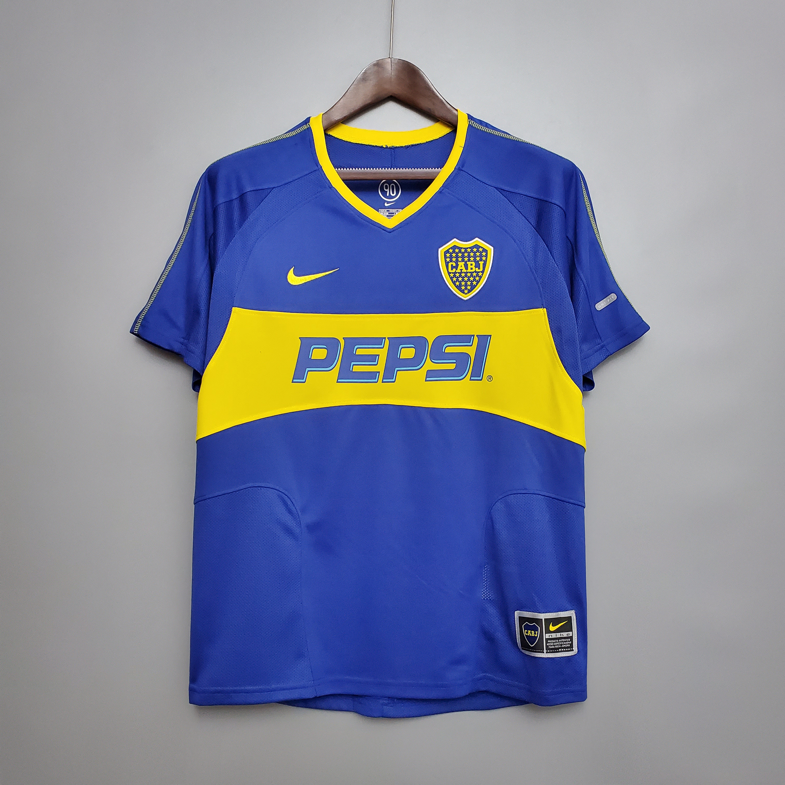
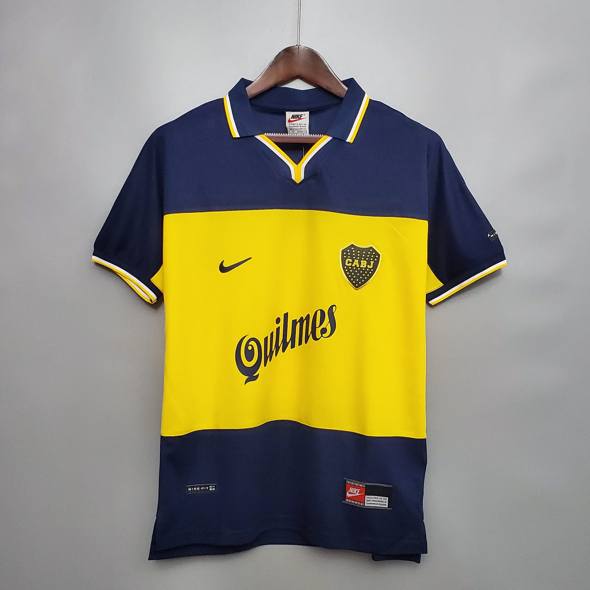

# Anotações gerais sobre GIT e GIT HUB!

### Redimensionando imagem com link https:


### Redimensionando imagem com link do git:




## Links:
[Resize image](https://gist.github.com/uupaa/f77d2bcf4dc7a294d109)

## Imagens com links!
[](https://www.xbox.com/pt-BR/xbox-game-pass)

## Inserindo código fonte:

```python
pais = Brasil
nascimento = 1998
```

## Inserindo lista de tarefas (task list):

- [x] Fazer código
- [x] Subir dados
- [ ] Finalização do projeto

### Database diagram Hospital Medland:


Link: [https://dbdiagram.io/d/64fe1f7002bd1c4a5e4c3674](https://dbdiagram.io/d/64fe1f7002bd1c4a5e4c3674)

### Serviços e recursos utilizados na nuvem
| Serviço          | Funcionalidade                 |
|------------------|--------------------------------|
| AWS Glue Catalog | Para catalogar dados           |
| AWS Glue Crawler | Ferramenta para rastrear dados |