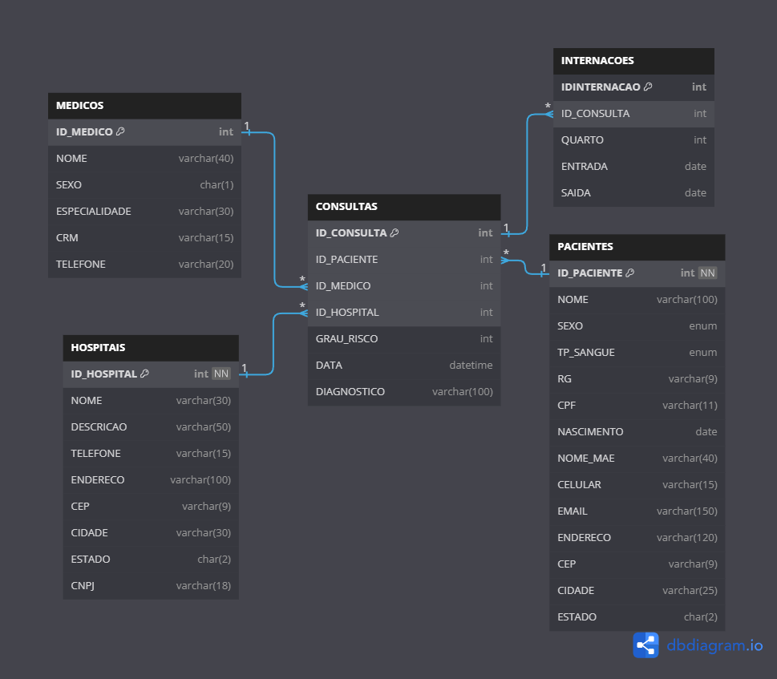

# Introdução

Esse projeto surgiu da minha necessidade de por em prática conteúdos estudados ao longo do tempo como SQL, Python, Cloud (AWS), PySpark e tipos de arquivos (JSON, CSV, Parquet). Nele eu simulei a criação de um banco de dados transacional para uma empresa pequena empresa de saúde que conta com dois hospitais de médio porte na capital mineira Belo Horizonte. Abaixo segue uma descrição das três etapas da modelagem de dados seguidas nesse projeto.

* **Modelo lógico** - Depois de compilar os requisitos do negócio, nessa etapa já começamos a pensar em chaves primarias, chaves estrangeiras e todo o esboço do modelo, aqui a modelagem é mais detalhada. Descrever com os dados serão armazenados e seus relacionamentos é importante, pois nesse nível as regras de integridade e normalização são estabelecidas para garantir a consistência dos dados. Aqui já são feitos rabiscos do diagrama do nosso banco, mas calma lá! Não necessariamente já definimos a tecnologia aqui, e tão pouco já é feita a criação do banco de dados.

*  **Modelo físico** - Agora sim temos que definir uma tecnologia para implementar o que foi decidido no modelo lógico, ela é a representação física de tudo que foi definido antes. É importante escolher um banco de dados que se adapte e suporte as necessidades do negócio, levando em consideração os detalhes técnicos e de desempenho. E nosso caso especifico, decidimos por utilizar o SGBD MySQL!

* **Modelo físico** - Agora sim temos que definir uma tecnologia para implementar o que foi decidido no modelo lógico, ela é a representação física de tudo que foi definido antes. É importante escolher um banco de dados que se adapte e suporte as necessidades do negócio, levando em consideração os detalhes técnicos e de desempenho. E nosso caso especifico, decidimos por utilizar o SGBD MySQL!

Depois de finalizando o modelo físico esse foi o resultado:

